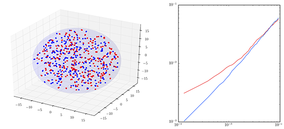
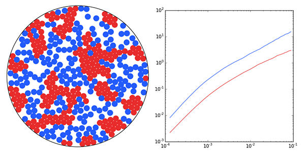
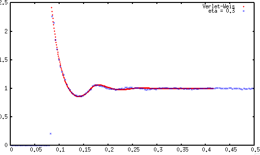

title: Projects

## [BCIM (Brownian Colloid Simulator)](https://github.com/dankolbman/BCIM)

BCIM is a molecular dynamics simulation that uses brownian dynamics to simulate
active (self propelled) colloids. It is being used and developed to study
the mechanics and migratory behavior of cancer cells. BCIM is written to support
massively parallel computation across many nodes as well as local parallelization
via the GPU using OpenCL. It also features automatic data loging and notebook
generation output to a website. The simulation engine is written primarily in
[Julia](http://julialang.org/), a new language for scientific computing, with
post proccessing done in python.

## [Brownian](https://github.com/dankolbman/brownian)

## [Macromolecule Simulator](https://github.com/dankolbman/MSim)

A basic simulator that provides a simple model of particles under periodic
boundaries using Metropolis-Monte Carlo Methods as outlined by Frenkel and Smit
in 'Understanding Molecular Simulation'. Intended for use in simulating
anisotropic macro-molecules to study the mixing behavior of proteins in the
retina.

## [More](https://github.com/dankolbman?tab=repositories)
Other smaller projects and snippets can be found on my 
[GitHub](https://github.com/dankolbman?tab=repositories)
